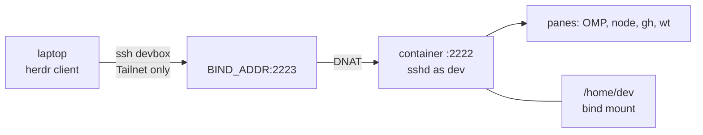

<div align="center">

# 📦 devbox

**Containerised remote development environment for an AI coding workstation.**

One Docker container with its own unprivileged `sshd`, published only on the node's Tailscale address.
A [herdr](https://herdr.dev) client on a laptop attaches to it as a saved machine and runs OMP agents inside.

[Setup](docs/setup.md) · [Connecting](docs/connecting.md) · [Git identities](docs/git.md) ·
[Secrets](docs/secrets.md) · [CLI](docs/cli.md) · [Docker](docs/docker.md) · [Security](docs/security.md)

</div>

---

The container **is** the sandbox. Agents running with bypassed permissions reach the project tree, the
internet and a rootless project Docker daemon - never the host filesystem, never the host's root Docker
daemon, and never a private key: the box holds public keys only.



## 🚀 60-second start

Workstation side, from the laptop:

```bash
./bin/push <workstation>                                              # sync the repo to ~/devbox
ssh <workstation> 'cd ~/devbox && ./bin/devbox env'                   # .env from .env.example, BIND_ADDR from Tailscale
ssh -t <workstation> 'cd ~/devbox && sudo ./bin/rootless-docker'      # once: project Docker, asks for a password
ssh <workstation> 'cd ~/devbox && ./bin/devbox up && ./bin/devbox doctor'
herdr machine add devbox --label "Devbox"                            # once the ~/.ssh/config blocks below exist
ssh <workstation> 'cd ~/devbox && ./bin/devbox skills'                # optional: agent skills + browser automation
./bin/sync-omp                                                        # optional: this laptop's OMP preset → devbox
```

Not optional: the **Devbox Laptop key in 1Password** (only `~/.ssh/devbox.pub` on disk), the two **`~/.ssh/config`
blocks**, and a non-empty **`BIND_ADDR`**. All three are in [Setup](docs/setup.md).

## 💻 Laptop setup

The laptop is the only place a private key or a 1Password session ever lives; the devbox borrows them per
connection. Two scripts make the laptop match:

```bash
./bin/install-agent   # omp launcher, gh shim, credential helper, fence, agent gitconfigs - same as the devbox
./bin/laptop-doctor   # acceptance test: keys, ~/.ssh/config, signing, the override, tokens, connections
```

- **Keys** - one `id_<slug>.pub`/`signing_<slug>.pub` pair per identity in
  `~/.config/devbox/identities.conf`, plus `devbox`: 1Password SSH items, public halves only in `~/.ssh`,
  selected per `Host` by `IdentityFile <name>.pub` + `IdentitiesOnly`.
- **Git** - your own commits sign through `op-ssh-sign`; agents run through the `omp` launcher and get HTTPS
  remotes, per-operation tokens, a bot author and no signing, on the same clones.
- **Tokens** - one `GH_TOKEN_<SLUG>` per identity in `~/.config/devbox/secrets.env` (mode 600) and each
  identity's GitHub App credentials in its own `app` directory, read only by agent sessions.

`laptop-doctor` names what is missing; the [devbox-laptop](.agents/skills/devbox-laptop/SKILL.md) skill and
[Git identities](docs/git.md#laptop-install) walk the fixes.

## 📚 Documentation

| Doc                                | Read it when                                                                                                            |
|------------------------------------|-------------------------------------------------------------------------------------------------------------------------|
| [Setup](docs/setup.md)             | First deploy, `.env` reference, laptop key, `~/.ssh/config`, laptop agent install                                       |
| [Connecting](docs/connecting.md)   | Getting a shell: herdr panes, `ssh devbox`, Moshi, `devbox shell`                                                       |
| [Git identities](docs/git.md)      | Cloning repos, the identity registry, manual vs agent git, signing, laptop install                                      |
| [Toolchain](docs/toolchain.md)     | What is installed, versions, OMP, Moshi hooks, agent skills                                                             |
| [Secrets](docs/secrets.md)         | Box-wide vs per-project, per-identity `gh` tokens, GCP ADC, App creds                                                   |
| [CLI reference](docs/cli.md)       | Every `bin/devbox`, `bin/push`, `bin/sync-omp`, `bin/sync-identities`, `bin/install-agent` and `bin/laptop-doctor` flag |
| [Networking](docs/networking.md)   | Exposure model, why UFW cannot help, port forwarding                                                                    |
| [Docker](docs/docker.md)           | Project containers, the rootless daemon, `devbox-ports`                                                                 |
| [Operations](docs/operations.md)   | Redeploy, restart, backup, `doctor`, troubleshooting                                                                    |
| [Security model](docs/security.md) | Boundaries, trust assumptions, what an escaped agent reaches                                                            |

## ⚡ Cheat sheet

```bash
./bin/push <workstation> --up        # deploy + start (keeps state; asks before killing SSH sessions)
ssh devbox                           # shell in the container
ssh -A devbox                        # + push, pull, sign as yourself (forwards the 1Password agent)
herdr                                # attach panes; they survive client exit
ssh -N -L 5173:localhost:5173 devbox # reach a dev server
ssh devbox 'cd projects/app && docker compose up -d && devbox-ports'  # project containers on localhost
ssh <workstation> 'cd ~/devbox && ./bin/devbox doctor'
ssh <workstation> 'cd ~/devbox && ./bin/devbox sessions'   # who is connected (a recreate kills them)
./bin/sync-omp                       # push this laptop's OMP preset into the devbox
./bin/install-agent                  # laptop-side: same agent git override as the devbox
./bin/laptop-doctor                  # laptop-side acceptance test: keys, configs, override, tokens
./bin/sync-identities                # push this laptop's identity registry into the devbox
```

## 🗺 Layout

```
.env.example          the only per-host configuration (.env is gitignored, never pushed)
Dockerfile            pinned toolchain; ends as USER dev
docker-compose.yml    ${BIND_ADDR}:${DEVBOX_SSH_PORT}:2222 is the whole network boundary
bin/devbox            host CLI: env, up, down, rebuild, bootstrap, skills, shell, sessions, logs, hook, keys, doctor
bin/rootless-docker   host-side, one-time: provisions the rootless project Docker daemon
bin/push              laptop-side rsync deploy
bin/sync-omp          laptop-side OMP preset sync (~/.omp/agent/config.yml → devbox)
bin/sync-identities   laptop-side identity registry sync (~/.config/devbox/identities.conf → devbox)
bin/install-agent     laptop-side: installs the omp launcher, gh shim, devbox-identities and agent git config
bin/laptop-doctor     laptop-side: checks keys, ssh/git config, the registry, the override, tokens and connections
container/            entrypoint.sh (PID 1), bootstrap.sh (user setup), skills.sh (optional), sshd_config
home/                                          templates installed into /home/dev by bootstrap (and onto the
                                                laptop by install-agent)
home/.config/devbox/identities.conf.example    identity registry template - you copy it to ~/.config/devbox/
                                                identities.conf; nothing seeds it for you
home/.local/libexec/devbox-identities          the one reader of identities.conf: sourceable library and CLI
home/.config/devbox/git/agent.gitconfig.tpl    template devbox-identities renders into the agent gitconfig
docs/                 this documentation
.agents/skills/       agent skills: devbox-basics, devbox-setup, devbox-laptop, devbox-deploy
```

## 🤖 Working on this repo

[AGENTS.md](AGENTS.md) holds the conventions. Four skills in `.agents/skills/` route an agent through the
same material: [devbox-basics](.agents/skills/devbox-basics/SKILL.md) (what it is, how it is isolated),
[devbox-setup](.agents/skills/devbox-setup/SKILL.md) (first install, connection failures),
[devbox-laptop](.agents/skills/devbox-laptop/SKILL.md) (keys, configs, the agent override on the laptop),
[devbox-deploy](.agents/skills/devbox-deploy/SKILL.md) (shipping a change and applying it).
