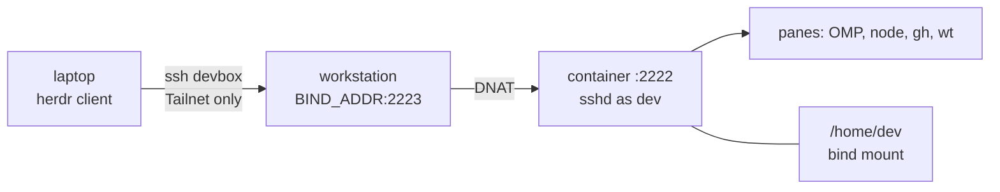

# 📦 devbox

Containerised remote development environment for the `workstation` AI workstation: a single Docker
container running its own unprivileged `sshd`, published only on the node's Tailscale address, so a
[herdr](https://herdr.dev) client on a laptop can attach to it as a saved machine and run OMP agents inside
it.

The container **is** the sandbox. Agents running with bypassed permissions reach the project tree and the
internet - never the host filesystem and never the host Docker daemon.



## 🚀 60-second start

```bash
./bin/push workstation                                        # sync the repo to ~/devbox
ssh workstation 'cd ~/devbox && ./bin/devbox env && ./bin/devbox up'
herdr machine add devbox --label "Workstation devbox"                # once the SSH setup below is done
```

The three things that are not optional: a **dedicated laptop key** (the 1Password agent cannot serve herdr's
background connections), the two **`~/.ssh/config` blocks**, and a non-empty **`BIND_ADDR`**. All three are in
[Setup](docs/setup.md).

## 📚 Documentation

| Doc                                | Read it when                                                        |
|------------------------------------|---------------------------------------------------------------------|
| [Setup](docs/setup.md)             | First deploy, `.env` reference, laptop key, `~/.ssh/config`         |
| [Connecting](docs/connecting.md)   | Getting a shell: herdr panes, `ssh devbox`, `devbox shell`, tunnels |
| [Git identities](docs/git.md)      | Cloning repos, personal vs work, commit signing                  |
| [Toolchain](docs/toolchain.md)     | What is installed, versions, adding a tool, OMP                     |
| [Secrets](docs/secrets.md)         | `op`, `devenv`, `gh` tokens, GitHub App credentials                 |
| [CLI reference](docs/cli.md)       | Every `bin/devbox` and `bin/push` command and flag                  |
| [Networking](docs/networking.md)   | Exposure model, why UFW cannot help, port forwarding                |
| [Operations](docs/operations.md)   | Redeploy, restart, backup, `doctor`, troubleshooting                |
| [Security model](docs/security.md) | Boundaries, trust assumptions, what an escaped agent reaches        |

Working on this repo rather than in it? [AGENTS.md](AGENTS.md) holds the conventions.

## 🗺 Layout

```
.env.example          the only per-host configuration (.env is gitignored, never pushed)
Dockerfile            pinned toolchain; ends as USER dev
docker-compose.yml    ${BIND_ADDR}:${DEVBOX_SSH_PORT}:2222 is the whole network boundary
bin/devbox            host-side CLI: env, up, down, rebuild, bootstrap, shell, logs, keys, doctor
bin/push              laptop-side rsync deploy
container/            entrypoint.sh (PID 1), bootstrap.sh (idempotent user setup), sshd_config
home/                 templates installed into /home/dev by bootstrap
docs/                 this documentation
```

## ⚡ Cheat sheet

```bash
./bin/push workstation --up            # deploy + start (repeatable, non-destructive)
ssh devbox                               # shell in the container
herdr                                    # attach panes; they survive client exit
ssh -N -L 5173:localhost:5173 devbox     # reach a dev server
ssh workstation 'cd ~/devbox && ./bin/devbox doctor'
```
