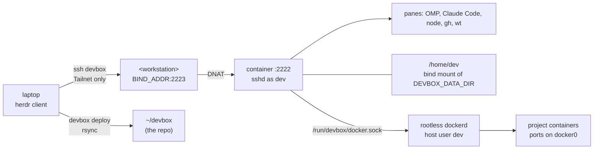

# 🏗️ Architecture

> devbox is one Docker container on the workstation: an unprivileged `sshd` running as `dev`, published only on the
> node's Tailscale address and loopback, with `/home/dev` on a host bind mount. A herdr client on the laptop attaches
> to it as a saved machine; project containers come from a rootless sibling Docker daemon, never the host's root one.

**Related:** [Installation](installation.md) · [Networking](networking.md) · [Docker](docker.md) ·
[Security model](security.md) · [Development](development.md)

---

## 🗺️ System map

> [!IMPORTANT]
> The container **is** the sandbox. Agents running with bypassed permissions reach the project tree, the internet and
> a rootless project Docker daemon — never the host filesystem, never the host's root Docker daemon, and never a
> private key: the box holds public keys only. It contains authority, not data: outbound network is unrestricted.
> See [Security model](security.md).

## 🧩 Components

| Component                      | Where                                                 | Role                                                                                                    |
| ------------------------------ | ----------------------------------------------------- | ------------------------------------------------------------------------------------------------------- |
| `devbox` container             | `docker-compose.yml`, `Dockerfile`                    | `ubuntu:26.04` plus the pinned toolchain; runs as `dev`, `cap_drop: [ALL]`, `no-new-privileges`         |
| `sshd`                         | `container/sshd_config`                               | Unprivileged, pubkey-only, container port `2222`, published as `${BIND_ADDR}:2223` and `127.0.0.1:2223` |
| `/home/dev`                    | `${DEVBOX_DATA_DIR}` on the host, also `/home/dev`    | Bind mount: dotfiles, keys, `~/.config/devbox`, `~/projects`, project Docker data — survives rebuilds   |
| `/opt/devbox/{container,home}` | `./container`, `./home` mounted read-only             | Entrypoint, bootstrap and the templates bootstrap installs into `/home/dev`                             |
| Project Docker daemon          | Host user `dev` (uid 1001), `/run/devbox/docker.sock` | Rootless `dockerd` from `sudo ./bin/devbox docker setup`; the socket _directory_ is bind-mounted in     |
| `devbox-docker-firewall`       | nftables table plus a systemd unit on the host        | Keeps published project ports off every interface but loopback and `docker0`                            |
| Identity registry              | `~/.config/devbox/identities.conf`                    | Who the box is, per account and directory tree; read only through `devbox-identities`                   |
| Agent launchers                | `~/.local/libexec/devbox-agent`                       | `omp`/`claude` symlinks that fence agent git to HTTPS, a bot author and per-operation tokens            |
| `./bin/devbox`                 | `cli/` → generated `bin/devbox`                       | One CLI for workstation and laptop; see [CLI reference](cli.md)                                         |

`network_mode: bridge` keeps the container on `docker0`, the one interface the project-port boundary admits, and which
— unlike a compose-managed bridge — is not removed by `down`.

## 🔀 Container startup

`container/entrypoint.sh` runs as `dev`, never root, under tini (`init: true`). The order is load-bearing — directories
before keys, keys before `sshd`, or the box starts unreachable:

| #   | Step                | What it does                                                                                               |
| --- | ------------------- | ---------------------------------------------------------------------------------------------------------- |
| 1   | Home skeleton       | Prepares the bind-mounted home tree root; `StrictModes` rejects a group- or world-writable home            |
| 2   | `sshd` host key     | Kept on the bind mount, so a rebuild or restore keeps the laptop's `known_hosts` valid                     |
| 3   | `authorized_keys`   | Rebuilt every start from `https://github.com/<DEVBOX_GITHUB_USER>.keys` and `DEVBOX_EXTRA_AUTHORIZED_KEYS` |
| 4   | Bootstrap           | `container/bootstrap.sh`, idempotent; a failure logs and continues rather than cost SSH access             |
| 5   | Project-port mirror | `devbox-ports`; forwards live in this container's netns and are lost on every recreate                     |
| 6   | `moshi-hook` daemon | Backgrounded, not supervised: there is no systemd, so it becomes a child of `sshd`, reaped by tini         |
| 7   | `sshd`              | `exec /usr/sbin/sshd -D -e` with `container/sshd_config`                                                   |

Steps 5 and 6 are best-effort: neither an unreachable project daemon nor a missing hook daemon may cost SSH access.

## 🚪 Ways in

| Route                | Run from    | Use it for                                                   |
| -------------------- | ----------- | ------------------------------------------------------------ |
| `herdr`              | Laptop      | Normal work; panes survive client exit and network loss      |
| `ssh devbox`         | Laptop      | One-off commands, scripts, tunnels, `rsync`, `git`           |
| Moshi                | Phone       | Watching and steering an agent away from the desk            |
| `./bin/devbox shell` | Workstation | Recovery when SSH, `authorized_keys` or Tailscale are broken |

All four land as `dev` in `/home/dev`. Details: [Connecting](connecting.md).

## 📁 Repository layout

| Path                                          | Contents                                                                                                    |
| --------------------------------------------- | ----------------------------------------------------------------------------------------------------------- |
| `.env.example`                                | The only per-host configuration (`.env` is gitignored, never deployed)                                      |
| `Dockerfile`                                  | Pinned toolchain; ends as `USER dev`                                                                        |
| `docker-compose.yml`                          | `${BIND_ADDR}:${DEVBOX_SSH_PORT}:2222` is the whole network boundary                                        |
| `bashly-settings.yml`                         | Bashly settings: builds `bin/devbox` from `cli/`                                                            |
| `Makefile`, `mise.toml`                       | Repo tasks (`make build`, `fmt`, `lint`, `check`) and the pinned prettier they run                          |
| `cli/`                                        | The CLI source: `bashly.yml` (commands), `commands/` (bodies), `lib/` (shared functions)                    |
| `bin/devbox`                                  | The CLI, generated by bashly and committed — never hand-edited ([CLI reference](cli.md))                    |
| `container/`                                  | `entrypoint.sh` (PID 1), `bootstrap.sh` (user setup), `skills.sh` (optional), `sshd_config`, `devbox-ports` |
| `home/`                                       | Templates installed into `/home/dev` by bootstrap (and onto the laptop by `devbox agent install`)           |
| `home/.config/devbox/identities.conf.example` | Identity registry template — you copy it to `~/.config/devbox/identities.conf`; nothing seeds it            |
| `home/.local/libexec/devbox-identities`       | The one reader of `identities.conf`: sourceable library and CLI                                             |
| `home/.config/devbox/git/agent.gitconfig.tpl` | Template `devbox-identities` renders into the agent gitconfig                                               |
| `docs/`                                       | This documentation                                                                                          |
| `.agents/skills/`                             | Agent skills: `devbox-basics`, `devbox-setup`, `devbox-laptop`, `devbox-deploy`, `devbox-cli`               |
| `.claude/skills/`                             | Symlinks to `.agents/skills/` — the one skills directory Claude Code reads                                  |
| `CLAUDE.md`                                   | Imports `AGENTS.md` for Claude Code                                                                         |

---

## ❓ FAQ

### Where do I actually work — laptop, workstation or container?

In the container. The laptop's and the workstation's `~/projects` are different trees from the container's
`/home/dev/projects`; clone there for agents to see a repo, and the bind mount does the rest.

### Why not open another port for a dev server?

So `docker-compose.yml` stays a one-port file. `ssh -N -L 5173:localhost:5173 devbox` reaches it with the existing
auth — see [Networking](networking.md#-access-patterns).

### Why not mount the Docker socket so agents can run containers?

The host's _root_ socket is the one thing forbidden: its API can bind-mount `/` and add capabilities. Nesting a daemon
inside is impossible too — rootless needs setuid `newuidmap`, which `cap_drop: ALL` plus `no-new-privileges` rule out.
Project containers come from the rootless sibling daemon instead — see [Docker](docker.md).

### Is `ssh devbox` a shell alias?

No. It is a `Host devbox` block in `~/.ssh/config`, so `rsync`, `git` and `ssh -L` honour it unchanged.

### Why not firewall the published port?

`ufw deny` cannot see Docker's DNAT; the bound address is the control — see
[Networking](networking.md#why-ufw-cannot-help).
