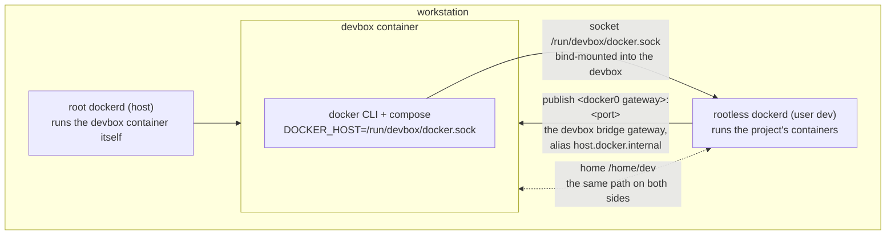

# 🐳 Docker

> Projects that bring their own containers work inside the devbox by speaking to a **second, rootless Docker daemon
> owned by a dedicated unprivileged host user** — never the host's root daemon, never a nested daemon. This page covers
> the architecture, the host prep script, the publish boundary, path identity and how to reach a service.

**Related:** [Architecture](architecture.md) · [Installation](installation.md) · [Networking](networking.md) ·
[Security Model](security.md) · [Secrets](secrets.md)

---

## 🗺️ The shape of it



One command provisions the whole host side, once:

```bash
sudo ./bin/devbox docker setup      # then, as your own user:
./bin/devbox rebuild
```

`sudo ./bin/devbox docker setup --check` reports state, changing nothing. Inside the devbox, `docker` and
`docker compose` work with no flags, no `sudo`, no socket path to remember.

## 🚫 Why not the two obvious options

| Option                              | What it actually grants                                                       |
| ----------------------------------- | ----------------------------------------------------------------------------- |
| Mount `/var/run/docker.sock`        | Host root. The API can start a container that bind-mounts `/` and adds caps   |
| Nested daemon in the devbox         | Needs setuid `newuidmap`, which `cap_drop: ALL` + `no-new-privileges` prevent |
| Privileged sidecar `dind`           | Same as the first row, one indirection later                                  |
| **Rootless sibling, dedicated uid** | Only what the `dev` host user can reach: `/home/dev` and world-readable paths |

Worth spelling out the nested case, since "docker-in-docker" usually means exactly that: rootless `dockerd` maps
subordinate ids via setuid helpers `newuidmap`/`newgidmap`, needing `CAP_SETUID` and the ability to gain privileges —
both removed here (rule 4, `AGENTS.md`), not worth restoring for Docker. Sharing the _host's_ rootless daemon leaves the
container's hardening untouched: nothing in `docker-compose.yml` was relaxed.

## 🧰 What the prep script does

| Piece                                                                     | What it does and why                                                                                                                                                                                                                                                                                  |
| ------------------------------------------------------------------------- | ----------------------------------------------------------------------------------------------------------------------------------------------------------------------------------------------------------------------------------------------------------------------------------------------------- |
| `uidmap`, `slirp4netns`                                                   | `newuidmap` maps subordinate ids; without it, one uid only, so privilege-dropping images (postgres, redis, node) can't start                                                                                                                                                                          |
| Host user `dev:devbox`, uid 1001                                          | The daemon's authority ceiling: a dedicated account keeps your home, SSH keys and sudo out of reach                                                                                                                                                                                                   |
| `DEVBOX_DATA_DIR` → `/home/dev`                                           | Path identity ([below](#-path-identity)); refuses mid-run, since it's just a `mv` plus `chown` — nothing recreated or lost                                                                                                                                                                            |
| `chown -R dev:devbox /home/dev`                                           | Daemon and container share a uid, so either writes files owned by `dev`                                                                                                                                                                                                                               |
| One `ufw` rule                                                            | `allow in on docker0 to <gateway>`: container-to-host traffic traverses `INPUT` (see [Networking](networking.md#why-ufw-cannot-help)), which UFW's default deny would drop — scoped to the one bridge and address the daemon publishes on, narrowed by the boundary table to the daemon's own sockets |
| `/etc/tmpfiles.d/devbox-docker.conf`                                      | `/run/devbox` must exist _before_ the daemon starts: rootlesskit copy-ups `/run`, symlinking only what's already there; tmpfiles recreates it on boot                                                                                                                                                 |
| `loginctl enable-linger dev`                                              | A never-logged-in account gets no systemd user manager, so the daemon couldn't boot or survive                                                                                                                                                                                                        |
| Unit in `/etc/systemd/user`, owned by root                                | `dockerd-rootless-setuptool.sh install` would put it in `~/.config/systemd/user` on the bind mount, letting the container rewrite the daemon's command line; the script runs only for its prerequisite `check`, owning the unit itself                                                                |
| `user@1001.service` drop-in → `/etc/devbox-docker`                        | dev's user manager reads units, drop-ins, wants links and `environment.d` from `XDG_CONFIG_HOME`/`XDG_DATA_HOME` — by default the bind mount. Pointed at root-owned directories (the wants link starting the daemon included), the container can't change the daemon's flags or add a host service    |
| `/etc/nftables.d/devbox-docker.nft` plus `devbox-docker-firewall.service` | The publish boundary and the one around the host's own services, the non-obvious piece ([below](#-where-a-published-port-is-bound))                                                                                                                                                                   |

`./bin/devbox doctor` checks `host.docker.internal` resolves, the boundary service is active with the ruleset this
checkout writes, and the daemon's user manager reads the root-owned directories — a project port silently exposed on
every interface, or a daemon configuration the container can edit, gets reported, not discovered.

## 🧱 Where a published port is bound

Two mechanisms — the first is a default, not a boundary.

### 1. The daemon's publish address

`--ip <gateway>` sets the host binding for the _default_ bridge only. A compose project always creates its own
user-defined bridge, which ignores it and publishes on `0.0.0.0`. Measured here: `-p 8098:80` on `bridge` bound
`172.17.0.1:8098`; the same spec on a compose network bound `0.0.0.0:8099`, reachable from the Tailnet _and_ the LAN.
The unit therefore also passes

```
--default-network-opt bridge=com.docker.network.bridge.host_binding_ipv4=<gateway>
```

which applies that option to every bridge network the daemon creates, so `docker ps` honestly shows the gateway address.

### 2. The boundary

That default still loses to an explicit `ports: ['0.0.0.0:8099:80']`, and a network created before the flag keeps its
stored option. Per-project port specs are therefore not a boundary; netfilter enforces one:

```
table inet devbox {
  chain input {
    type filter hook input priority filter - 10; policy accept;
    ct state established,related accept
    iifname "lo" accept
    iifname "docker0" socket cgroupv2 level 2 "user.slice/user-1001.slice" accept
    iifname "docker0" drop
    socket cgroupv2 level 2 "user.slice/user-1001.slice" drop
  }

  chain forward {
    type filter hook forward priority filter - 10; policy accept;
    iifname "docker0" ct state new oifname "tailscale0" drop
    iifname "docker0" ct state new ip daddr 100.64.0.0/10 drop
    iifname "docker0" ct state new ip6 daddr fd7a:115c:a1e0::/48 drop
  }

  chain output {
    type filter hook output priority filter - 10; policy accept;
    meta skuid 1001 ct state new fib daddr type local ip daddr != 127.0.0.0/8 drop
    meta skuid 1001 ct state new fib daddr type local ip6 daddr != ::1 drop
    meta skuid 1001 ct state new oifname "tailscale0" drop
    meta skuid 1001 ct state new ip daddr 100.64.0.0/10 drop
    meta skuid 1001 ct state new ip6 daddr fd7a:115c:a1e0::/48 drop
  }
}
```

The conntrack rule isn't decoration. `dockerd-rootless.sh` passes `--detach-netns`: the daemon runs in the _host_
namespace and only its containers get the detached one, so image-pull and DNS replies also arrive on a socket in that
slice. Without `ct state established` the daemon would have no outbound connectivity. An inbound connection is
`ct state new`, so it still meets the drop.

Matching is by the **listening socket's cgroup**, covering every port that daemon will ever publish, at any address,
without knowing port numbers: loopback and the devbox bridge are accepted, everywhere else dropped — so
`ports: ['5432:5432']` works from the devbox and host, invisible from Tailnet and LAN, whatever the compose file asks.
Unlike the DNAT case in [Networking](networking.md), these are ordinary host sockets, so `INPUT` genuinely applies.

The same table is the boundary around the host's own services. ufw's rule admits `docker0` to every port on the
gateway and the workstation's sshd listens on all addresses, so from `docker0` only the daemon's sockets are accepted
and the rest is dropped: the devbox reaches project ports and nothing else on the host. Its project containers would
get there one hop later — they leave through slirp4netns, a `dev` process in the host namespace — hence the output
chain refusing new connections from uid 1001 to any of the host's addresses. Loopback stays open, since the daemon's
DNS goes through systemd-resolved's stub there, and no container reaches it: `dockerd-rootless.sh` turns off
slirp4netns' host-loopback mapping. Ports the host's root daemon publishes are untouched, DNATed to their containers
before this table sees the packet.

And it keeps both off the Tailnet. Peers reach the devbox — its sshd is published on the Tailscale address — but nothing
in it needs to reach a peer, and a forwarded agent plus a peer's sshd is a way off this machine. So no new connection
leaves `docker0`, or leaves as uid 1001, through `tailscale0` or towards a Tailscale address (`100.64.0.0/10`,
`fd7a:115c:a1e0::/48`); replies to your inbound sessions are established and pass. Docker's DNAT runs before both
chains, so a root-daemon port published on the host's Tailscale address — a local LLM server, say — has already become
a container address and never matches: that traffic stays on the host. The address rules also cover `tailscaled` being
down, when the host's Tailscale address stops being local and a packet to it would follow the default route out to the
ISP.

It lives in its own `inet` table at lower priority than ufw's chains, so neither touches the other's rules; ufw still
needs its allow rule, since a packet accepted in one table isn't exempt from later ones.

> [!IMPORTANT]
> nft resolves that cgroup path to an id **when the table loads**, so the slice must already exist and the id goes stale
> if it's ever recreated. The unit is therefore pulled in by, ordered after and `PartOf=` `user@1001.service` — the
> lingering user manager that owns the slice — rather than merely after ufw, which at boot lost the race and left the
> boundary down.

The devbox deliberately sits on the _default_ bridge (`network_mode: bridge`): `docker0` exists whenever the host
daemon does, while a compose-managed bridge is removed by `./bin/devbox down` and recreated with a new address — both
the publish address and the boundary table's interface are keyed to it.

## 📁 Path identity

The daemon resolves bind-mount sources **on the host**. A compose file saying

```yaml
volumes:
  - ./data:/var/lib/postgresql/data
```

sends the container's path (`/home/dev/projects/app/data`) to the daemon, which opens it as a host path — working only
because the bind mount sits at `/home/dev` on the host too, hence `DEVBOX_DATA_DIR=/home/dev` and the uid switch to
`dev`.

> [!IMPORTANT]
> Keep projects under `/home/dev`: a bind mount from `/tmp` or `/opt` resolves against the host's own version of that
> path.

Ownership follows suit: the rootless daemon maps container `root` to uid 1001 (`dev` inside the container), so files a
container writes into a bind mount are yours. A container dropping to its own unprivileged user (postgres runs as
uid 999) writes files owned by a subordinate id, unreadable by `dev` — normal rootless behaviour.

> [!TIP]
> Keep database data directories in **named volumes**, inside the daemon's own storage, avoiding this.

## 🌐 Reaching a service

Three ways, in order of preference:

| #   | Route                                           | How                                                                                                                                                                                                                                                                                                                       |
| --- | ----------------------------------------------- | ------------------------------------------------------------------------------------------------------------------------------------------------------------------------------------------------------------------------------------------------------------------------------------------------------------------------- |
| 1   | From another container in the same stack        | Unchanged: compose networks and service DNS work as on a laptop; `postgres:5432` resolves                                                                                                                                                                                                                                 |
| 2   | Via `host.docker.internal`, from a devbox shell | Every port published _on the gateway_ (a `ports:` entry with no explicit host address) is reachable there: the name resolves to the devbox bridge gateway, the boundary table's one admitted interface. An entry naming `127.0.0.1` isn't — see [A compose file that binds 127.0.0.1](#-a-compose-file-that-binds-127001) |
| 3   | Via `localhost`, from a devbox shell            | Run `devbox-ports`, forwarding `127.0.0.1:<port>` to `host.docker.internal:<port>` for every gateway-published port, one `socat` per port. A loopback-bound publish is skipped with a warning naming the container, since a forward there relays to nothing                                                               |

```bash
docker compose up -d
devbox-ports            # sync (default); re-run only when new ports appear
devbox-ports status
devbox-ports stop
```

That last one exists so a project whose `.env` says `postgres://localhost:5432` needs no devbox-specific edit. Each
forward is a detached `socat` outliving its shell, every `docker compose restart`, and every rebuild — bound to the
port, not the container, dying only with the devbox itself. `container/entrypoint.sh` re-syncs on start, so
`./bin/devbox rebuild` restores forwards before sshd accepts a connection. Run `devbox-ports` once per added service,
not once per session.

From the laptop, tunnel as usual: `ssh -N -L 5432:localhost:5432 devbox &` reaches a mirrored port, and
`ssh -N -L 5432:host.docker.internal:5432 devbox &` reaches one without the mirror.

## 📍 A compose file that binds 127.0.0.1

A project publishing with an explicit loopback prefix — `'127.0.0.1:5432:5432'`, common and correct on a laptop — is
**unreachable from the devbox**: the daemon is a sibling, so that's the _host's_ loopback, with no devbox route to it.
Neither `host.docker.internal` nor `devbox-ports` can see the port, since nothing published on the bridge gateway.

Make the address a variable in the project's compose file, defaulting to today's behaviour:

```yaml
ports:
  - '${DOCKER_BIND_IP:-127.0.0.1}:${POSTGRES_PORT:-5432}:5432'
```

Then set `DOCKER_BIND_IP=172.17.0.1` in that project's devbox `.env` — the gateway address, printed by
`./bin/devbox doctor` and resolved by `host.docker.internal`. Laptops leave it unset, unaffected. This bind is safe: the
boundary table drops connections to a published port from every interface except `lo` and `docker0`, including ports
published to `0.0.0.0` (see [Where a published port is bound](#-where-a-published-port-is-bound)).

`<org>/<repo>` needs exactly this, plus one `devbox-ports` run:

```bash
cd ~/projects/work/<repo>
echo 'DOCKER_BIND_IP=172.17.0.1' >>.env
pnpm run docker:start
devbox-ports
pnpm dev                # apps on localhost:3000/4000-4002, natively in the box
```

The apps' own `localhost` URLs (`NEXT_PUBLIC_GATEWAY_URL`, `CORS_ORIGINS`, `AGENT_UPSTREAMS`, `AUTH_URL`) need no
change, since those processes run in the devbox and its loopback is theirs. Renaming the two container-facing values to
`host.docker.internal` instead of mirroring works for Postgres but breaks Langfuse: compose feeds `LANGFUSE_BASE_URL` to
`NEXTAUTH_URL`, which must match the operator's browser address over the tunnel.

> [!WARNING]
> Leave it `localhost:3001` and mirror; a wrong value fails silently, since OTel's span processor drops spans instead of
> raising.

`.env.local` holds vault-injected credentials and can't be generated in the devbox, which ships no `op` by design (see
[Secrets](secrets.md)). Generate it on the laptop with `pnpm run env:inject`, copy it in once — `.worktreeinclude`
carries it into every `wt` worktree.

## 🏗️ Building images

`docker build` and `docker compose build` work; `buildx` ships as a CLI plugin. Builds run on the rootless daemon with
the kernel's unprivileged overlayfs — no `--privileged` step, no `fuse-overlayfs` dependency. The image cache lives in
`/home/dev/.local/share/docker`, on the bind mount, surviving rebuilds and counting against host disk like any project
file.

## 📌 Versions

| Piece          | Pin                                   | Where                        |
| -------------- | ------------------------------------- | ---------------------------- |
| Docker CLI     | `DOCKER_CLI_VERSION` (static tarball) | `Dockerfile`                 |
| Compose plugin | `DOCKER_COMPOSE_VERSION` (+ checksum) | `Dockerfile`                 |
| Buildx plugin  | `DOCKER_BUILDX_VERSION` (+ checksum)  | `Dockerfile`                 |
| Daemon         | The host's `docker-ce`                | `apt-get` on the workstation |

> [!NOTE]
> Keep `DOCKER_CLI_VERSION` equal to the host daemon's (`docker version` on the host). An older CLI is fine; compose
> refuses an API newer than the server.

---

## ❓ FAQ

### Is this "docker-in-docker"?

No: docker _beside_ docker, a sibling daemon reached over a socket. True nesting needs the container to create user
namespaces with setuid helpers, ruled out by `cap_drop: ALL` and `no-new-privileges`.

### Does the container now have host root?

No — the socket belongs to `dev`: no password, no keys, no sudo, no files outside `/home/dev`. A container started
through it can bind-mount host paths but reads only world-readable ones, writing only what `dev` owns. The host's root
daemon isn't exposed.

### Why a separate user instead of my own account?

The daemon's user _is_ the authority ceiling: running it as the deploying user would let anything with the socket mount
`/home/<you>/.ssh` as that uid, reading the host's private keys.

### Can an agent in the devbox stop the devbox container?

No — it runs on the host's root daemon, unreachable from the container. It can stop and start project containers —
that's the point.

### Do project ports end up on the Tailnet?

No, by two independent mechanisms: the daemon publishes on the bridge gateway by default (`--default-network-opt`, so
`docker ps` shows `172.17.0.1:5432`), and `devbox-docker-firewall` drops input to those sockets outside loopback and the
bridge, even when a port spec overrides the default. `./bin/devbox doctor` fails if the boundary service is inactive or
stale, or the address drifted.

### Can the devbox reach the workstation's own services?

No — only the project daemon's published ports. `devbox-docker-firewall` drops everything else `docker0` sends the
host, the workstation's sshd included, and stops project containers getting there through slirp4netns. Both checks
should come back empty:

```bash
ssh devbox 'timeout 3 bash -c "</dev/tcp/host.docker.internal/2222" && echo reachable'
ssh devbox 'docker run --rm alpine:3 nc -w 3 <workstation-lan-ip> 2222 </dev/null'
```

### Can the devbox reach other machines on my Tailnet?

No — it is reachable _from_ the Tailnet, never the other way. `devbox-docker-firewall` drops every new connection from
`docker0` or uid 1001 through `tailscale0` or to a Tailscale address. A service the host's root daemon publishes on the
host's own Tailscale address still works, and never leaves the host: Docker rewrites it to the container first. Both
checks should come back empty (a peer's Tailscale IP from `tailscale status`):

```bash
ssh devbox 'timeout 3 bash -c "</dev/tcp/<peer-tailscale-ip>/22" && echo reachable'
ssh devbox 'docker run --rm alpine:3 ping -c1 -W2 <peer-tailscale-ip>'
```

### Why does `doctor` say `devbox-docker-firewall is inactive` after a reboot?

`systemctl status devbox-docker-firewall` showing `cgroupv2 path fails: No such file or directory` is the unit loading
before `user-1001.slice` existed — a unit written by an older `devbox docker setup`. Re-run
`sudo ./bin/devbox docker setup`: it rewrites the unit with the ordering above and restarts it.

### Why does `docker pull` hang, then fail with an i/o timeout?

Almost certainly the boundary table dropping the daemon's _reply_ traffic — check `/etc/nftables.d/devbox-docker.nft`
still carries `ct state established,related accept`, and the running table matches the file
(`sudo nft list table inet devbox`). The error names whichever address Go dialled last, looking like an IPv6 problem; it
isn't.

### Why does `docker` say "Cannot connect to the Docker daemon"?

The daemon is down or unprovisioned. On the host: `sudo ./bin/devbox docker setup --check`, then
`systemctl --user --machine=dev@.host status docker` for its log.

### Where does the project daemon's `daemon.json` go?

`/etc/devbox-docker/config/docker/daemon.json`, written as root, then
`sudo systemctl --user --machine=dev@.host restart docker`. `~/.config/docker/daemon.json` is ignored on purpose:
anything in the devbox can write the bind mount, and a daemon configuration it controls could turn off the boundaries
this page describes. Same for units and `environment.d`: dev's user manager reads them from `/etc/devbox-docker`.

### What if a service is running but nothing in the devbox can reach its port?

Run `devbox-ports`: it names the case. A `[WARN]` means the compose file binds the _host's_ loopback, unreachable
here — parameterise the address and set `DOCKER_BIND_IP` (see
[A compose file that binds 127.0.0.1](#-a-compose-file-that-binds-127001)). An `[OK]` means the port's on the gateway
and mirrored, so `localhost:<port>` works; `docker port <container>` shows the same directly.

### Why is a bind mount empty inside a project container?

Path identity was broken — either the project lives outside `/home/dev`, or `DEVBOX_DATA_DIR` isn't `/home/dev`.
`sudo ./bin/devbox docker setup --check` reports the second case.

### Does a redeploy wipe images and volumes?

No — they live under `/home/dev/.local/share/docker` on the bind mount, which `devbox deploy` never touches and
`rebuild` never deletes. Removing them is `docker system prune`, by hand.

### Can I use the host's root daemon for something else?

It still runs the devbox container itself, and it's yours over `ssh <workstation>`. Nothing inside the devbox can reach
it.
