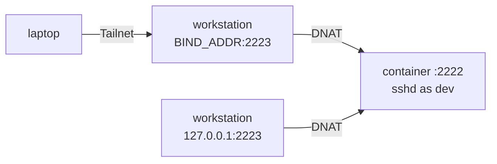

# 🔌 Networking

> One published port, bound to one address. The devbox container is reachable only from the Tailnet and loopback — never
> from the public internet — because the compose mapping scopes the port to `BIND_ADDR` (the node's Tailscale IP), not
> because of a firewall rule. Everything else goes through SSH.

**Related:** [Docker](docker.md) · [Git Identities](git.md) · [Security Model](security.md) ·
[Operations](operations.md)

---

## 🔐 Security model

| Layer     | Behavior                                                                                    |
| --------- | ------------------------------------------------------------------------------------------- |
| Docker    | Publishes `2223` on `127.0.0.1` and `BIND_ADDR` (the node's Tailscale IP) — never `0.0.0.0` |
| Tailscale | The only route to `BIND_ADDR`                                                               |
| Result    | Reachable from the Tailnet, invisible from the public internet                              |



The compose mapping is the entire network boundary:

```yaml
ports:
  - '${BIND_ADDR:?BIND_ADDR is empty - run ./bin/devbox env}:${DEVBOX_SSH_PORT}:2222'
  - '127.0.0.1:${DEVBOX_SSH_PORT}:2222'
```

> [!IMPORTANT]
> `BIND_ADDR` is **mandatory**. Empty, the first mapping would degrade to `:2223:2222` — `0.0.0.0`, every interface — so
> compose itself refuses it (`required variable BIND_ADDR is missing a value`), not just `./bin/devbox up`'s preflight:
> a bare `docker compose up` skips the CLI. Every command that loads the compose project interpolates the file, so while
> it's empty `up`, `down`, `logs` and `ps` fail; exec-based ones — `shell`, `bootstrap`, `hook`, `sessions` — still
> work, so the recovery shell stays available. `./bin/devbox env` fills it; `docker rm -f devbox` stops a box already
> published on `0.0.0.0`.

### Why UFW cannot help

Docker publishes via `nat/PREROUTING` DNAT: packets reaching the container are _forwarded_, bypassing `INPUT`, so
`ufw deny 2223` can't block a published port ([moby/moby#17496](https://github.com/moby/moby/issues/17496)). The DNAT
rule itself enforces the address scope, so `BIND_ADDR` — not a firewall rule — is the control. That is why it's
mandatory.

Conversely, for project containers: traffic _from_ the container _to_ a host address is delivered locally, traversing
`INPUT`, which UFW's default deny would drop — why `sudo ./bin/devbox docker setup` adds one rule,
`allow in on docker0 to <gateway>` (no source clause: arriving there means a bridge container). It admits every port on
that address, so the boundary table narrows it: from `docker0` only the project daemon's sockets answer, and the
workstation's own services — its sshd on `0.0.0.0` included — stay out of the devbox's reach, as they do for the
daemon's containers.

Project ports mirror this: the rootless daemon's listeners _are_ plain host-namespace sockets, so `INPUT` applies — a
netfilter table, not the publish address, is the boundary. See [Docker](docker.md).

## 🌐 Port reference

| Port                    | Owner                  | Reachable from                                                                    |
| ----------------------- | ---------------------- | --------------------------------------------------------------------------------- |
| `2222` (workstation)    | Workstation's sshd     | Whatever the host's ufw allows, on `0.0.0.0` — never the devbox or its containers |
| `2223` (published)      | Devbox container sshd  | `BIND_ADDR` (Tailnet) and `127.0.0.1`, DNATed to container `:2222`                |
| `2222` (in container)   | Devbox container sshd  | Always the in-container listener, behind the `2223` mapping                       |
| Project ports (default) | Rootless Docker daemon | `docker0` (the bridge gateway) — `host.docker.internal:<port>` from the devbox    |

Nothing else is published from the devbox container. IPv6 is not published: only the IPv4 Tailscale address from
`tailscale ip -4` and `127.0.0.1`.

## 🔎 Verifying exposure

```bash
ssh <workstation> 'ss -ltnp | grep 2223'
```

Expect two lines: `<tailscale-ip>:2223` and `127.0.0.1:2223` — a `0.0.0.0:2223` line means the devbox is
internet-exposed, and `doctor` fails on it explicitly.

## 🚪 Access patterns

### Dev servers and other ports

Nothing else is published from the devbox container; forward per port, per session:

```bash
ssh -N -L 5173:localhost:5173 devbox &          # dev server
ssh -N -L 8080:localhost:8080 -L 5432:localhost:5432 devbox &   # several at once
```

`AllowTcpForwarding yes` in `container/sshd_config` enables this; `PermitTunnel no` limits it to port forwards.
`AllowAgentForwarding yes` is separate, forwarding the laptop's 1Password SSH agent only for an explicit `ssh -A devbox`
connection, never automatically — see [Git Identities](git.md#-manual-work-on-the-devbox--the-escape-hatch).

### Project containers

Project containers (see [Docker](docker.md)) publish onto `docker0` — the devbox's bridge gateway — by default,
reachable at `host.docker.internal:<port>`; `devbox-ports` mirrors it to `127.0.0.1:<port>`. Naming an address in
`ports:` overrides that: `0.0.0.0` still can't reach off-host (boundary table drops it), while `127.0.0.1` binds the
_host's_ loopback, invisible to the devbox. Tunnel either way:

```bash
ssh -N -L 5432:localhost:5432 devbox &                  # after `devbox-ports` mirrors the port
ssh -N -L 5432:host.docker.internal:5432 devbox &        # directly, without the mirror
```

## 🛠️ Where network behavior is defined

| File                      | Responsibility                                                                               |
| ------------------------- | -------------------------------------------------------------------------------------------- |
| `docker-compose.yml`      | The address-scoped `ports` mapping — the entire network boundary                             |
| `.env.example`            | `BIND_ADDR` (mandatory, filled by `./bin/devbox env`) and `DEVBOX_SSH_PORT` (`2223`)         |
| `container/sshd_config`   | In-container sshd on `2222`; `AllowTcpForwarding`, `PermitTunnel` and `AllowAgentForwarding` |
| `cli/lib/docker_setup.sh` | `docker setup`: the `allow in on docker0 to <gateway>` UFW rule and `devbox-docker-firewall` |

---

## ❓ FAQ

### Why 2223 and not 22?

`2222` is the workstation's sshd; `2223` is the container's — both live on one node without collision, and inside it
sshd always listens on `2222`.

### Can I reach the devbox from another Tailnet device?

Yes — any device on the Tailnet can reach `BIND_ADDR:2223`, given an authorized key. Copy the `Host devbox` block and
the key.

### What if the Tailscale address changes?

`up` binds to whatever `BIND_ADDR` says: a stale value fails to bind, or binds a dead address. Re-run `./bin/devbox env`
and `up`; `doctor` flags the mismatch.

### Can I publish a dev server properly instead of tunnelling?

Possible, not recommended: needs a second address-scoped `ports` entry and a container recreate (`./bin/devbox up`) — a
new boundary to audit each time. SSH forwarding needs no configuration and inherits existing auth.

### Does the container get its own IP on the Tailnet?

No — it sits on Docker's default bridge (`docker0`); the Tailnet terminates on the host, DNATing in. Outbound internet
works normally; outbound over the Tailnet overlay does not — `devbox-docker-firewall` drops every new connection from
`docker0` through `tailscale0` or to a Tailscale address, so a peer can reach the devbox but the devbox can't reach a
peer's Tailscale address. That peer's LAN or public address stays reachable like the rest of the network, and
`tailscaled`'s world-accessible LocalAPI socket can relay to it from a project container — both accepted limits
([Security Model](security.md#-accepted-limits)). A port the host's root daemon publishes on the host's own Tailscale
address still works, rewritten to its container on the host ([Docker](docker.md#2-the-boundary)).

### Is IPv6 published?

No — only the IPv4 Tailscale address from `tailscale ip -4` and `127.0.0.1`.

### Are project containers on the Tailnet?

No — the rootless daemon publishes on the devbox bridge gateway, not `0.0.0.0`; `devbox-docker-firewall` blocks `INPUT`
outside loopback and that bridge (see [Why UFW cannot help](#why-ufw-cannot-help)), overriding even a port spec's
default. So `ports: ['5432:5432']` reaches only the devbox and host — see [Docker](docker.md).
Nor can they reach a Tailnet peer over the overlay: running as dev's uid or one of its subordinate uids in the host's
namespace — a `--network host` container included — their traffic meets the same table's output rules.

### Why did the devbox lose internet when I enabled an exit node?

With a Tailscale exit node set on the workstation, its outbound traffic leaves through `tailscale0`, and
`devbox-docker-firewall` drops every new connection from `docker0`, or from dev's uid or its subordinate uids, on that
interface — the devbox and the
project daemon (image pulls included) lose the internet. Clear the exit node on the workstation
(`tailscale set --exit-node=`); the boundary has no exception for it.
